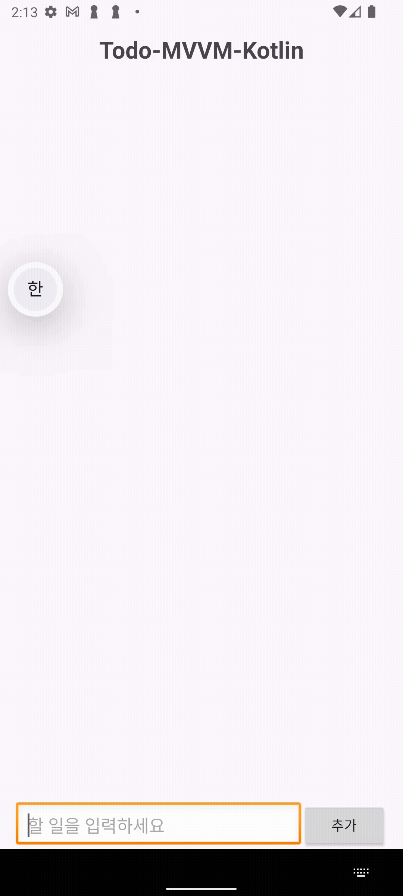

# Todo-MVVM-Kotlin

### 프로젝트 설명
이 프로젝트는 [Todo-MVVM-Java](https://github.com/DDH-975/Todo-MVVM-Java) 프로젝트의 연장선상으로,
기존 Java로 구현했던 MVVM 구조를 Kotlin 언어로 재구현하며 문법적 차이와 구조적 개선점을 학습하는 데 목적을 두었습니다.  
이를 바탕으로 코틀린 MVVM 패턴 실습에 초점을 맞춘 간단한 TodoList 앱을 구현하였으며,
Room 데이터베이스를 활용해 로컬 데이터를 저장하고 View ↔ ViewModel ↔ Model 간의 역할 분리를 실습하였습니다

---

## 🛠️ 기술 스택

* **언어 (Languages)**: Kotlin, XML
* **개발 환경**: Android Studio
* **아키텍처 (Architecture)**: MVVM (Model-View-ViewModel)
* **데이터베이스 (Database)**: Room
* **비동기 처리 (Async)**: Kotlin Coroutines, LiveData

---

## 🔄 앱 구조 및 흐름

앱은 **Room DB → Repository → ViewModel → View** 흐름을 기반으로 동작합니다.

---

### 1. Room DB (Model 계층)

DB 접근을 위한 `Dao` 인터페이스를 정의합니다.
LiveData를 반환하여 데이터 변경 시 자동으로 UI에 반영되도록 합니다.

```kotlin
@Dao
interface TodoDao {
    @Query("SELECT * FROM TodoData")
    fun getAllData(): LiveData<List<TodoEntity>>

    @Insert(onConflict = OnConflictStrategy.Companion.REPLACE)
    fun setInsertTodo(todo: TodoEntity)

    @Query("DELETE FROM TodoData")
    fun deleteAllTodo()

    @Query("DELETE FROM TodoData WHERE id = :id")
    fun deleteDataWhereId(id: Int)
}
```

---

### 2. Repository

Repository는 DB 접근 로직을 캡슐화하여 ViewModel이 데이터 소스를 직접 알지 않아도 되도록 합니다. <br>
비동기 처리를 위해 **suspend**로 메서드를 선언하여 **코루틴**에서 메서드가 작동하도록 합니다.

```kotlin
class TodoRepository private constructor(private val dao: TodoDao) {
    val allData: LiveData<List<TodoEntity>> = dao.getAllData()

    suspend fun insertData(todoEntity: TodoEntity) {
        dao.setInsertTodo(todoEntity)
    }

    suspend fun deleteDataById(id: Int) {
        dao.deleteDataWhereId(id)
    }


    companion object {
        @Volatile
        private var INSTANCE: TodoRepository? = null
        fun getInstance(application: Application): TodoRepository =
            INSTANCE ?: synchronized(this) {
                INSTANCE ?: TodoRepository(
                    TodoDataBase.getInstance(application).dao()
                ).also { INSTANCE = it }
            }
    }
}
```

---

### 3. ViewModel

ViewModel은 Repository를 통해 데이터를 가져오고, 이를 `LiveData`로 관리하여 View에 전달합니다. <br>
또한, 화면 회전 등의 생명주기 변화에도 데이터를 안전하게 보존하며, UI 관련 로직을 담당하는 핵심 계층입니다.

```kotlin
class TodoViewModel(private val repo: TodoRepository) : ViewModel() {
    val allData: LiveData<List<TodoEntity>> = repo.allData

    fun insertData(tododata: TodoEntity) {
        viewModelScope.launch(Dispatchers.IO) {
            repo.insertData(tododata)
        }
    }

    fun deleteById(id: Int) {
        viewModelScope.launch(Dispatchers.IO) {
            repo.deleteDataById(id)
        }
    }
}

class TodoViewModelFactory(private val repo: TodoRepository) : ViewModelProvider.Factory {
    override fun <T : ViewModel> create(modelClass: Class<T>): T {
        if (modelClass.isAssignableFrom(TodoViewModel::class.java)) {
            @Suppress("UNCHECKED_CAST")
            return TodoViewModel(repo) as T
        }
        throw IllegalArgumentException("Unknown ViewModel class")
    }
}

```

ViewModel에서는 코루틴을 사용하기 위해 **viewModelScope**를 활용하였습니다. <br>
이를 통해 Repository에 선언된 `suspend` 함수들을 **Dispatchers.IO**에서 비동기적으로 실행하여 메인 스레드를 차단하지 않고 안전하게 데이터 작업을 처리할 수 있습니다.

```kotlin
    fun insertData(tododata: TodoEntity) {
        viewModelScope.launch(Dispatchers.IO) {
            repo.insertData(tododata)
        }
    }

    fun deleteById(id: Int) {
        viewModelScope.launch(Dispatchers.IO) {
            repo.deleteDataById(id)
        }
    }
```

---

### 4. View (Activity & Adapter)

#### ViewModel 초기화 (MainActivity)

```kotlin
 todoViewModel = ViewModelProvider(this, TodoViewModelFactory(repo) )[TodoViewModel::class.java]
```

#### LiveData 관찰 (자동 업데이트)

```kotlin
 todoViewModel.allData.observe(this) { todoData ->
            todoAdapter.setData(todoData)
        }
```

➡️ LiveData 값이 변경될 때마다 RecyclerView UI가 자동 갱신됩니다.

#### 사용자 입력 처리

```kotlin
 binding.btnAdd.setOnClickListener {
            val text = binding.etTodo.text
            if (text.isEmpty()) {
                Toast.makeText(this, "할일을 입력하세요", Toast.LENGTH_SHORT).show()
            } else {
                val entitiy = TodoEntity(todo = "$text")
                todoViewModel.insertData(entitiy)
            }
        }
```

#### 삭제 콜백 인터페이스

```kotlin
fun interface OndeleteClickListener {
    fun deleteClick(id: Int)
}
```

```kotlin
override fun onBindViewHolder(holder: TodoAdapter.ViewHolder, position: Int) {
        val pos = holder.bindingAdapterPosition
        if (pos != RecyclerView.NO_POSITION) {
            holder.tvTodo.text = todoData.get(pos).todo

            holder.btnDelete.setOnClickListener { it ->
                listener.deleteClick(todoData.get(pos).id)
            }
        }
    }
```

➡️ 삭제 버튼 클릭 → Adapter 콜백 실행 → ViewModel의 `deleteById()` 호출 → Repository → Room DB 삭제 → LiveData 변경 → UI 자동 반영

---

## 📌 전체 데이터 흐름 요약

1. **사용자 입력 (추가/삭제)** → `MainActivity` → `ViewModel` 호출
2. **ViewModel** → `Repository` 통해 DB 요청 위임
3. **Repository** → `Room DB` 접근 (비동기 처리)
4. **DB 변경** → `LiveData` 업데이트 → `ViewModel` → `View` 자동 반영

---

## 🧩 Todo-MVVM-Kotlin에서 개선·추가된 코드
### 1️⃣ Repository의 `companion object` - 싱클톤 패턴 구현
```kotlin
   companion object {
        @Volatile
        private var INSTANCE: TodoRepository? = null
        fun getInstance(application: Application): TodoRepository =
            INSTANCE ?: synchronized(this) {
                INSTANCE ?: TodoRepository(
                    TodoDataBase.getInstance(application).dao()
                ).also { INSTANCE = it }
            }
    }
```

이 코드의 목적은 **`repository`를 앱 전체에서 단 한번만 생성**하기 위해서입니다.
`repository`는 내부적으로 `RoomDB(TodoDataBase)`를 사용하는데 RoomDB가 하나의 앱에 여러개 존재하게 되면 DB파일 충돌, 데이터 불일치 문제등이 발생하게 됩니다.
그래서 `repository`를 **싱글톤**으로 구현하여 모든 `ViewModel`이 하나의 **DB 접근 통로**를 공유하도록 하였습니다.

### ⚙ 코드가 동작하는 방식
1. `getInstance()` 를 호출할 때마다
    - `INSTANCE` 가 null이면 새로 만들고,
    - 이미 있다면 기존 인스턴스를 반환.

2. `@Volatile` : 여러 스레드에서 동시에 접근해도 인스턴스가 제대로 보이도록 보장.
3. `synchronized(this)` : 여러 스레드가 동시에 `getInstance()`를 호출해도한 번만 생성되게 잠금 처리.

---

### 2️⃣ ViewModel의 TodoViewModelFactory클래스 - ViewModel을 안전하게 만드는 ‘공장 클래스’

```kotlin
class TodoViewModelFactory(private val repo: TodoRepository) : ViewModelProvider.Factory {
    override fun <T : ViewModel> create(modelClass: Class<T>): T {
        if (modelClass.isAssignableFrom(TodoViewModel::class.java)) {
            @Suppress("UNCHECKED_CAST")
            return TodoViewModel(repo) as T
        }
        throw IllegalArgumentException("Unknown ViewModel class")
    }
}
```
`TodoViewModelFactory`는 ViewModel 생성 시 필요한 의존성(`Repository`)을 안전하게 주입하기 위해 사용하는 클래스입니다.  
기본적으로 `ViewModelProvider`는 매개변수가 없는 기본 생성자를 호출하지만, 이 프로젝트의 `TodoViewModel`은 `TodoRepository`를 생성자에서 받아야 하기 때문에 **직접 Factory를 구현하여 ViewModelProvider에 전달**해야 합니다.

즉 `TodoViewModelFactory`클래스는 ViewModel이 외부 의존성(Repository 등)을 필요로 할 때 **안정적으로 인스턴스를 생성하고 관리**할 수 있게 도와주는 역할을 합니다.

### ⚙ 코드가 동작하는 방식
1. `ViewModelProvider`가 `create()`를 호출할 때 → `modelClass`가 `TodoViewModel`인지 확인
2. 맞다면 `TodoViewModel(repo)`를 생성하고 반환
3. 잘못된 타입이면 `IllegalArgumentException` 예외를 발생시켜 타입 안전성을 보장

---

## 📱 주요 기능

* Todo 추가 / 삭제
* Room DB를 통한 데이터 영구 저장
* LiveData & 코루틴을 통한 **실시간 UI 업데이트**

---

## 📊 구조 다이어그램

```text
사용자 입력
    ↓
   View (Activity / Adapter)
    ↓
 ViewModel (TodoViewModel)
    ↓
 Repository (TodoRepository)
    ↓
 Room DB (TodoDao, TodoEntity)
    ↓
 LiveData 업데이트
    ↓
 View 자동 반영 (Observer)
```

---

## 실행 화면 (Screenshots & GIFs)




